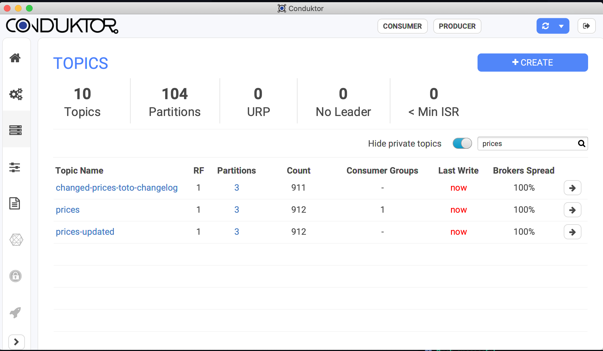

Sample Kafka Streams in Kotlin using:

- Json Serde using Kotlin `reified` 
- There is a Avro version of the Kafka Streams too
- A `Topology` with a `Transformer`, and a state, to prevent sending duplicate downstream
- JUnit 5 tests using `TopologyTestDriver`
 
The program:
- Rely on `localhost:9092`
- creates the necessary topics (in and out) if necessary (using the `AdminClient`)
- produce random data in the input topic every seconds

If you look in [Conduktor](https://conduktor.io), you will see 3 topics with data:

